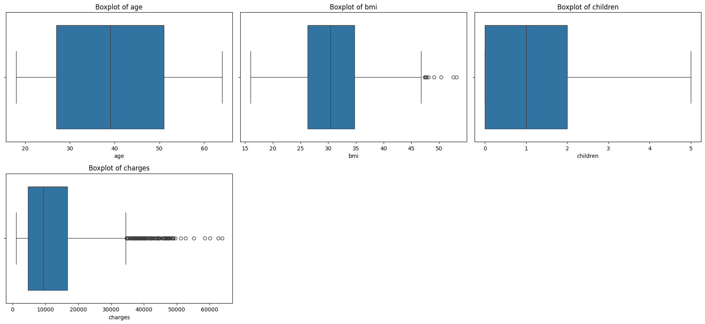
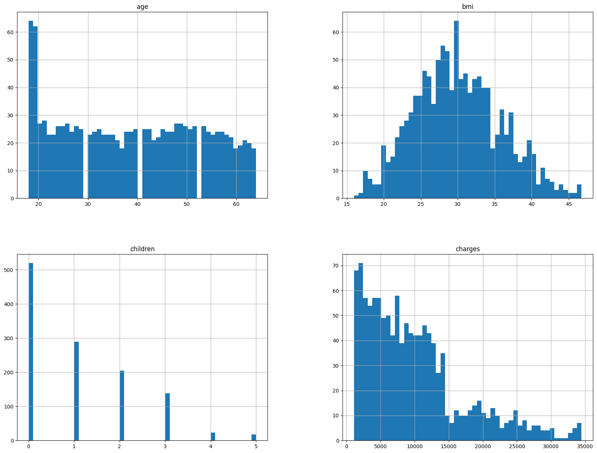
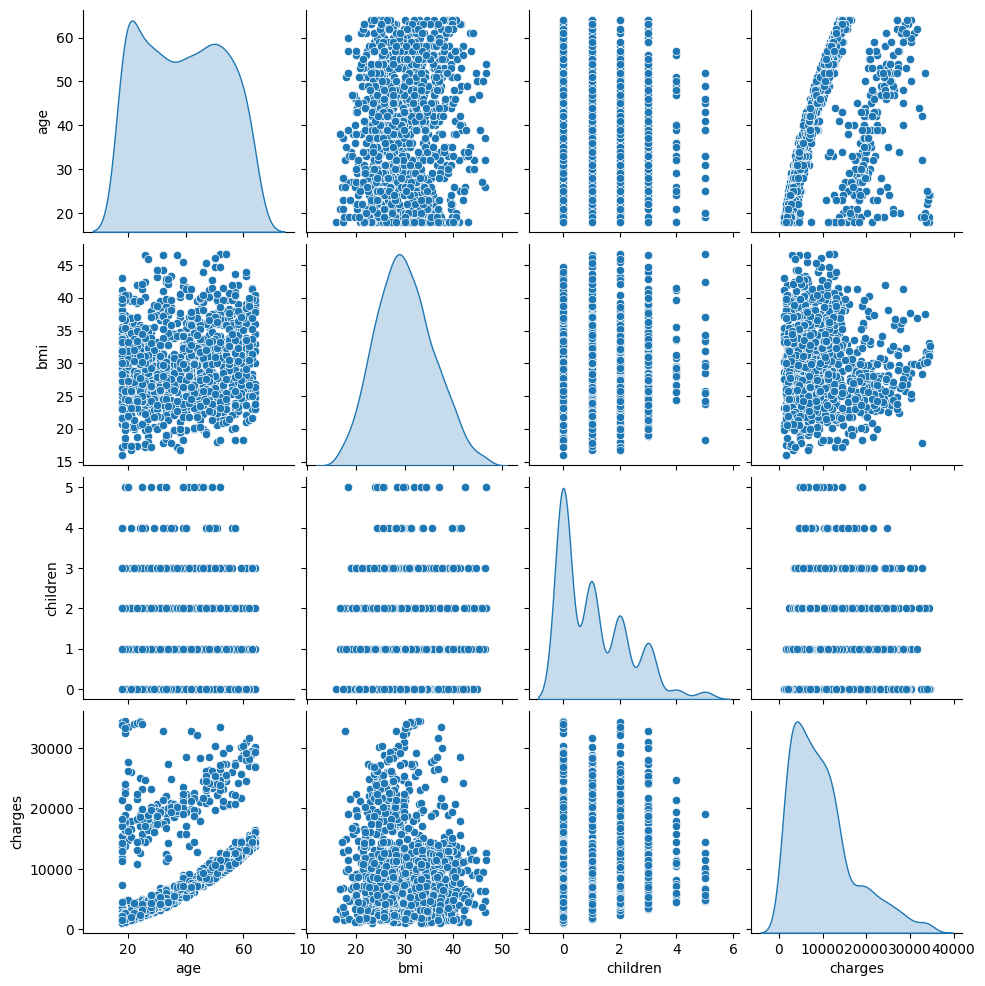
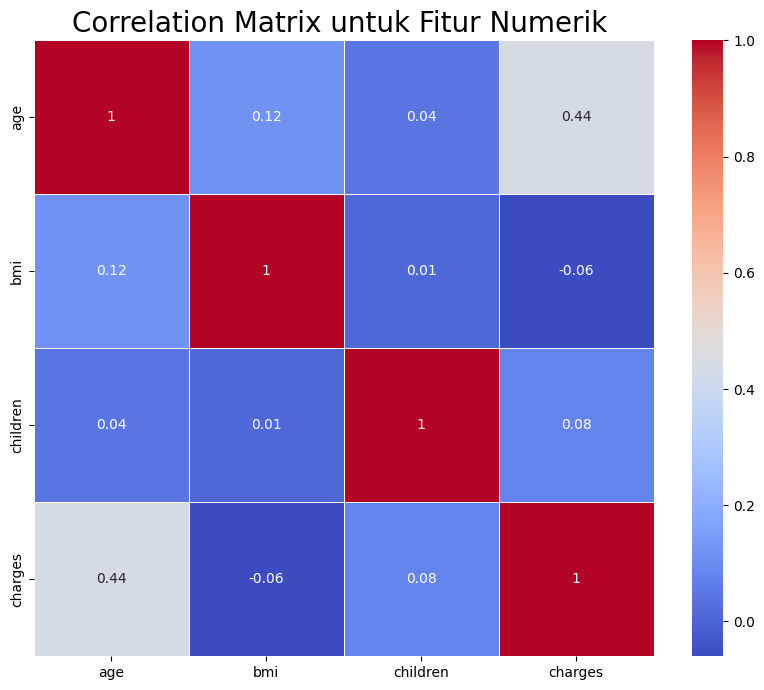
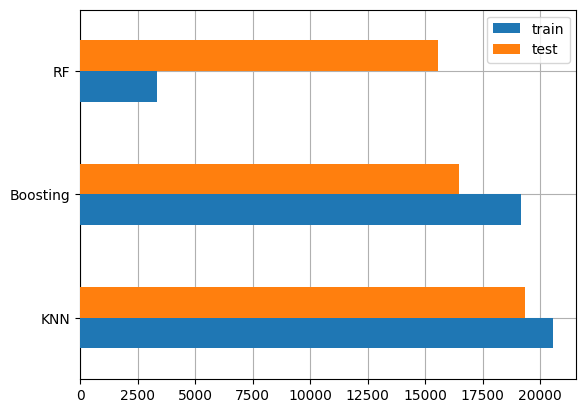

# Proyek Predictive Analysis

## Domain Proyek
Data yang akan kita tangani kali ini adalah **Medical Cost Personal Dataset**, yang dipengaruhi oleh beberapa parameter yang menjadi acuan penentuan nominal. data yang kita gunakan didapat dari kaggle yaitu website penyedia dataset yang terpercaya. author/pembuat dari dataframe tersebut adalah Miri Choy. 
Masalah tersebut harus diselesaikan karena model machine learning yang kita gunakan dapat bermanfaat bagi pengguna baru saat ingin mengetahui harga asuransi secara cepat.

## Business Understanding
1. Problem Statements
Penanganan asuransi kesehatan membutuhkan waktu yang lama. saat ini kita membutuhkan model yang dapat memprediksi nominal asuransi. model tersebut sangat membantu bagi member baru yang ingin mengikuti program asuransi kesehatan.
2. Goals
goals adalah member baru hanya memberikan input nilai, kemudian model akan mengecek, dan user baru mengetahui hasilnya dengan cepat.
3. Solution Statement
Solusi dalam membuat model adalah kita membuat regresi karena data yang akan kita tangani adalah supervised learning. kita akan mengajukan tiga solution statement agar mencari model terbaik. Model akan dievaluasi menggunkan mse (mean square error)

## Import library yang dibutuhkan
- numpy==2.2.6
- matplotlib==3.9.3
- pandas==2.2.3
- seaborn==0.13.2
- scikit-learn==1.5.2

## Data Understanding
dataset : https://www.kaggle.com/datasets/mirichoi0218/insurance
Pada dataset insurance.csv kita mendapatkan data dengan jumlah 1338 baris dan 7 kolom. Selain informasi, kita juga melakukan exploratory data analysis. informasi dari Kolom tersebut adalah sebagai berikut:
- age merupakan informasi umur yang **bertipe data int64**
- sex merupakan informasi gender yang **bertipe data object**
- bmi merupakan informasi berat ideal dengan satuan kg/m^2 yang **bertipe data float64**
- children merupakan informasi banyak anak yang **bertipe data int64**
- smoker merupakan informasi apakah member merokok atau tidak yang **bertipe data object**
- region merupakan informasi residential di USA yang **bertipe data object**
- charges adalah medical costs billed dari health insurance yang **bertipe data float64**

informasi yang didapatkan dari data tersebut adalah:
1. Dataset ini tidak memiliki data kosong sehingga kita tidak melakukan penaganan data. 
2. Dataset mengalami outliers pada kolom bmi dan charges. Untuk mengatasi masalah tersebut kita gunakan drop untuk menghapus baris yang kosong.
3. Jumlah sampel memperlihatkan pembagian yang setara untuk member laki-laki dan perempuan. yaitu perempuan sebesar 51.2 % dan laki-laki sebesar 48.8 %
4. Jumlah member yang merokok sebesar 11.6 % dari total member
5. Jumlah sampel dari member dalam region memiliki pembagian sebagai berikut:
    - northwest memiliki presentase 25.6 %
    - southeast memiliki presentase 25.3 %
    - northweast memiliki presentase 24.7 %
    - southwest memiliki presentase 24.4 %

selanjutnya adalah pengecekan histogram univariate analysist untuk kolom numerik. hasilnya adalah:
- charges memiliki persebaran data lebih banya pada rentang dibawah 15000 dolar dan kemudian menurun ke kanan
- umur memiliki persebaran lebih banyak pada angka awah 20 tahun
- bmi adalah body mass index yang memiliki satuan (kg/m^2) dan memiliki nilai ideal di 18.5 hingga 24.9 namun pada data ternyata persebaran lebih banyak di data setelah 25 kg/m^2
- kebanyakan member tidak memiliki anak / children = 0

selanjutnya kita melakukan pengecekan bivariate analysist nilai charges dengan kolom kategorikal. hasil adalah:
- rata-rata nilai charges terhadap sex memiliki perbandingan sama
- kebanyakan rata-rata nilai charges cenderung ke orang yang tidak merokok
- region relatif sama untuk keempat tempat, namun northeast memiliki nilai tinggi terhadap charges 

selanjutnya kita melakukan pengecekan bivariate analysist dan correlation matrix nilai charges dengan kolom numerik. hasilnya adalah:
- age memiliki persebaran data linear dengan charges, jadi semakin bertambah usia maka nilai charges akan semakin tinggi juga
- kolom bmi dan children memiliki persebaran sembarang terhadap charges

## Data Preparation
data preparation digunakan agar feature dapat diproses dengan baik oleh algoritma machine learning sehingga didapatkan model yang baik. tahap yang dilakukan adalah :
1. Penanganan Outlier, penanganan outlier menggunakan metode IQR untuk melakukan pengecekan outlier yang kemudian data yang terindikasi outlier akan di hapus. dari cara tersebut jumlah data yang awalnya 1338 menjadi 1193. Metode IQR digunakan untuk penanganan karena dapat mengidentifikasi outlier yang berada di luar Q1 dan Q3. Nilai apa pun yang berada di luar batas ini dianggap sebagai outlier. Hal pertama yang perlu dilakukan adalah membuat batas bawah dan batas atas. Untuk membuat batas bawah, kurangi Q1 dengan 1,5 * IQR. Kemudian, untuk membuat batas atas, tambahkan 1.5 * IQR dengan Q3.
2. Encoding feature kategorikal, merubah features categorical menjadi nominal. agar data kategorikal dapat diproses oleh machine learning karena kolomnya sudah berubah menjadi tipe data nominal. Machine learning hanya bisa memproses data numerik sehingga kita harus merubah data kategorikal terlebih dahulu.
3. Train Test Split, membagi data menjadi train dan test dengan perbandingan 90 : 10. untuk membantu membagi data menjadi dua bagian   yaitu 90 % data training dan 10 % data testing. Data training digunakan untuk melatih model / modeling dan data testing untuk mengetes hasil dari modeling.
4. Standarisasi, merubah standarisasi dari feature numerical agar memiliki persebaran data yang rata. Persebaran data yang merata dibutuhkan agar nilai inputan tidak terlalu dominan ke salah satu sisi. Standarisasi menggunakan StandardScaler() agar mendapatkan nilai mean = 0 dan standard deviasi = 1

## Modeling
modeling adalah bagian penting untuk membuat machine learning. Pada project ini kita menggunakan beberapa cara modeling yaitu:
1. KNN, menggunakan ‘kesamaan fitur’ untuk memprediksi nilai dari setiap data yang baru. Dengan kata lain, setiap data baru diberi nilai berdasarkan seberapa mirip titik tersebut dalam set pelatihan. Pemilihan nilai k sangat penting dan berpengaruh terhadap performa model. Jika kita memilih k yang terlalu rendah, maka akan menghasilkan model yang overfit dan hasil prediksinya memiliki varians tinggi. Jika kita memilih k terlalu tinggi, maka model yang dihasilkan akan underfit dan prediksinya memiliki bias yang tinggi. **Parameter yang diubah adalah:**
    - n_neighbors = 10 (mengatur jumlah tetangga terdekat)
**kelebihan:**
    - Sederhana & Mudah Dipahami
    - Tidak Butuh Training lama
    - Adaptif pada Data Non-linear data kompleks
**kekurangan:**
    - Lambat saat Prediksi
    - Sangat Tergantung pada Skala Fitur
    - Sensitif terhadap Outlier dan Noise
    - Tidak cocok untuk dataset besar
2. Random Forest, model machine learning yang termasuk ke dalam kategori ensemble (group) learning. Ide dibalik model ensemble adalah sekelompok model yang bekerja bersama menyelesaikan masalah. Bagging atau bootstrap aggregating adalah teknik yang melatih model dengan sampel random. Dalam teknik bagging, sejumlah model dilatih dengan proses sampling dengan penggantian. pada kasus regresi random forest, prediksi akhir adalah rata-rata prediksi seluruh pohon dalam model ensemble. **Parameter yang diubah adalah:**
    - n_estimators = 50 (mengatur banyaknya jumlah pohon keputusan dalam random forest)
    - max_depth = 25 (mengatur kedalaman maksimum setiap pohon)
    - random_state = 55 (mengatur seed untuk pengacakan agar hasilnya reproducible)
    - n_jobs = -1 (artinya menggunakan semua core CPU untuk pelatihan paralel)
**kelebihan:**
    - Akurasi tinggi
    - Tahan terhadap overfitting
    - Bisa menangani data besar dan fitur banyak
    - Bisa mengukur pentingnya fitur
    - Robust terhadap outlier dan data yang hilang
**kekurangan:**
    - Model besar dan lambat untuk interpretasi
    - Training dan prediksi bisa lebih lambat daripada model sederhana
    - Ukuran model besar

3. Boosting Algorithm, algoritma ini bertujuan untuk meningkatkan performa atau akurasi prediksi. Caranya adalah dengan menggabungkan beberapa model sederhana dan dianggap lemah (weak learners) sehingga membentuk suatu model yang kuat (strong ensemble learner). Algoritma boosting sangat powerfull. Cara penggunaannya menggunakan algoritma boosting atau kombinasi beberapa algoritma boosting dalam modelnya. Meskipun demikian, hal ini tetap bergantung pada kasus per kasus, ruang lingkup masalah, dan dataset yang digunakan. **Parameter yang diubah adalah:**
    - learning_rate = 0.02 (mengontrol kontribusi masing-masing estimator terhadap prediksi akhir)
    - random_state = 55 (seed untuk pengacakan agar hasilnya konsisten saat dijalankan berulang)
**kelebihan:**
    -  Akurasi sangat tinggi
    - Mengurangi bias dan varians
    - Fleksibel
    - Tahan terhadap overfitting
**kekurangan:**
    - Training lama
    - Sulit dituning
    - Lebih rentan terhadap noise

Pelatihan dilakukan dilakukan pada ketiga model. namun model yang dipilih adalah **Random Forest** karena modul memiliki nilai error paling kecil dibandingkan dengan model lainnya. Hal ini bisa karena random forest terkenal dengan robust dan tahan dengan overfitting sehingga dapat memberikan hasil yang memuaskan.

## Evaluation
evaluasi dilakukan untuk memberikan informasi mengenai hasil performa setiap model setelah dilakukan pelatihan. hasil dari pelatihan diukur errornya menggunakan **MSE (Mean Squared Error)** adalah salah satu metrik evaluasi yang digunakan untuk mengukur seberapa akurat model regresi dalam memprediksi nilai. MSE menghitung rata-rata dari kuadrat selisih antara nilai sebenarnya (aktual) dan nilai prediksi dari model. Hasilnya adalah sebagai berikut:

Pada gambar diatas ditampilkan mengenai nilai pengecekan error hasil dari pelatihan dan pengujian ketiga model. dari diagram tersebut dapat dilihat bahwa model KNN memiliki nilai error pada train sebesar 20554 dan test sebesar 19339. model Random Forest memiliki nilai error pada train sebesar 3350 dan test sebesar 15563. model Boosting memiliki nilai error pada train sebesar 19147 dan test sebesar 16455. dari diagram tersebut kita dapat melihat model random forest unggul pada training dan testing.
Cara Kerja MSE:
1. Model membuat prediksi untuk setiap data.
2. Hitung selisih antara nilai aktual dan nilai prediksi.
3. Kuadratkan selisih tersebut agar error negatif tidak saling menghapus.
4. Jumlahkan semua error kuadrat.
5. Bagi dengan jumlah total data untuk mendapatkan nilai rata-rata.

**Random Forest** memberikan hasil yang paling mendekati. Untuk melakukan peningkatan performa, lakukanlah hal yang sama (pengaturan parameter) pada semua algoritma yang digunakan. Selain itu, Anda juga dapat melakukan optimasi parameter dengan menerapkan teknik Grid Search. 